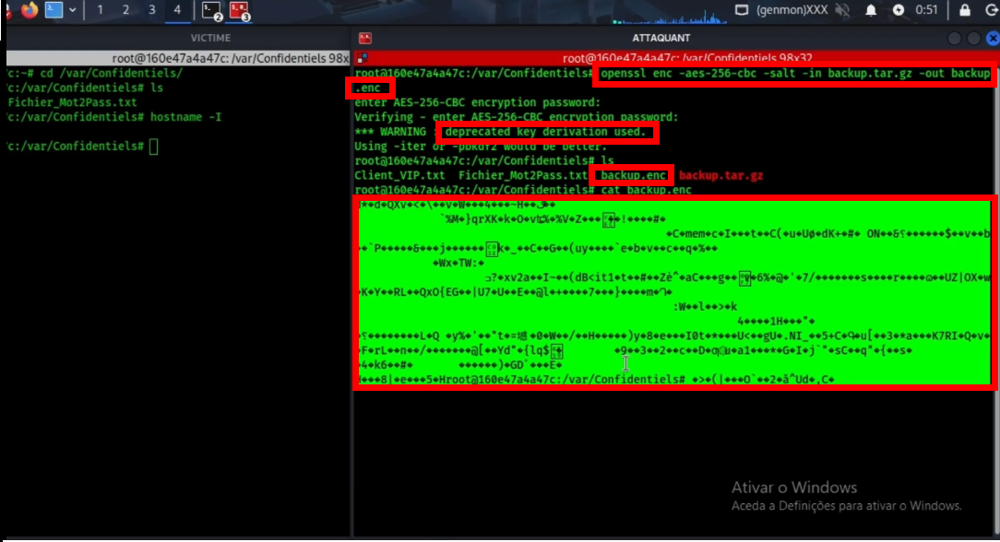
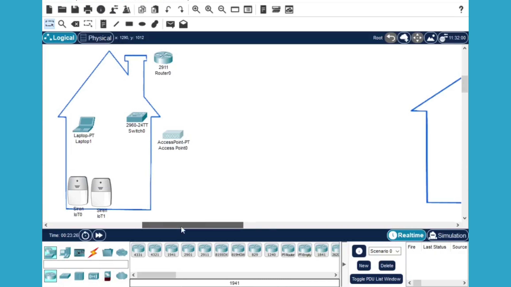
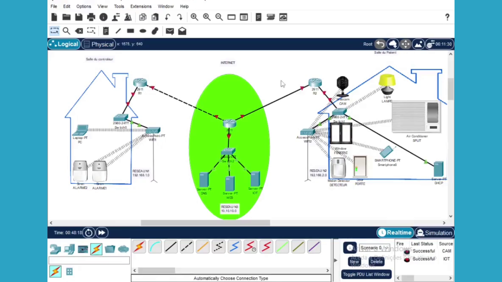
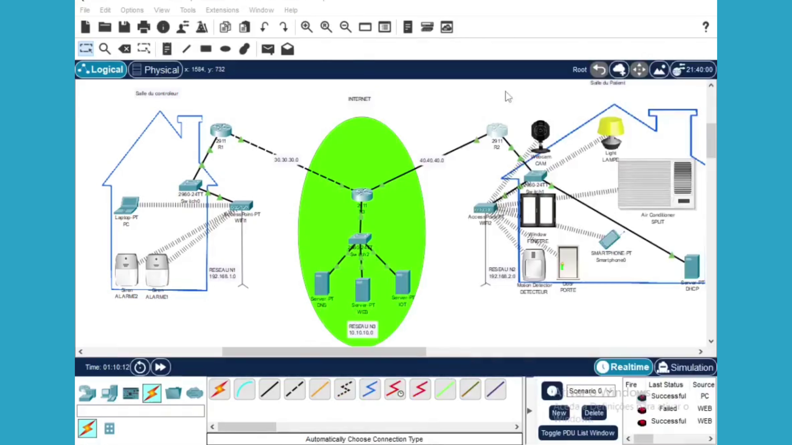
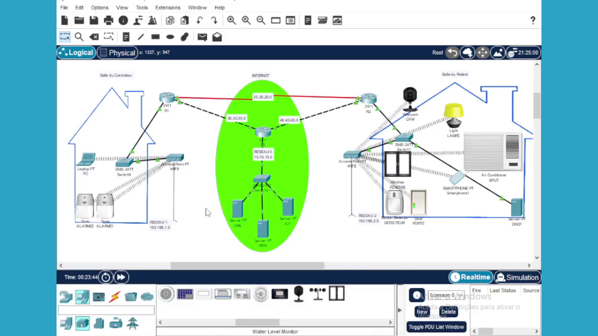
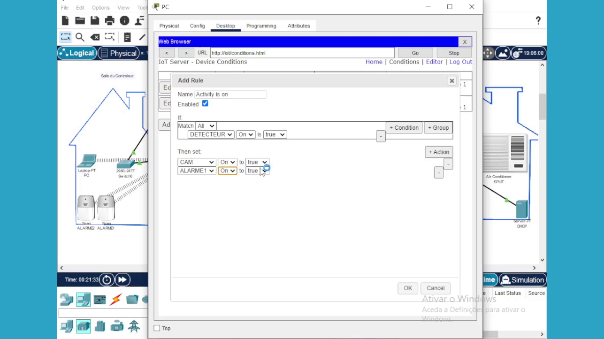

<h1 align="center">👋 Salut, je suis Herminio Romeu</h1>

  <b>🛡️ Analyste SOC Junior & Pentester en Cybersécurité</b>

---

### 👨‍💻 À propos de moi

Autodidacte passionné par la cybersécurité depuis **2021**, orienté **analyse SOC junior** et **pentest**.  
Je développe mes compétences à travers des **laboratoires personnels**, des **simulations d’attaques réelles** dans un cadre **légal**, ainsi que la **vulgarisation de la cybersécurité** via YouTube et des lives de sensibilisation sur TikTok.

Je m’appuie sur :
- 🧪 **Labs pratiques**
- 🧩 **Preuves de concept (PoC)**
- 📄 **Démonstrations techniques documentées**

---

## 🎓 Formation & Apprentissage Continu

- 🏫 **Cisco – Introduction à la Cybersécurité** (Attestation)
- 📚 Autoformation continue : **TryHackMe**, **BlackBox**, veille technologique

---

## 🧾 Certifications

- ❌ Aucune 

---

## 🛠️ Compétences Techniques

**Systèmes**
- Linux (Kali, Ubuntu)
- Windows

**Réseaux**
- TCP/IP, DNS, DHCP, VPN
- Analyse de trafic réseau

**Sécurité**
- SOC L1
- MITM
- Pentesting
- Analyse de vulnérabilités

**Outils**
- Nmap, Wireshark
- Bettercap, Ettercap
- Metasploit, Burp Suite

**Virtualisation**
- VMware
- VirtualBox
- Docker

---

# 🚀 Projets Pratiques Sélectionnés

---

## 🔴 PROJET 1 — Attaque par Ransomware (LAB éducatif)

### 🎯 Contexte
Simulation d’une attaque par ransomware dans un environnement de laboratoire contrôlé afin de comprendre :
- le mécanisme de chiffrement
- l’impact sur la disponibilité des données

### 🧪 Environnement Technique
- 🧨 Attaquant : Kali Linux  
- 🎯 Victime : Conteneur Docker  
- 🌐 Réseau : Local isolé  
- 🛠️ Outils : Terminal Linux, commandes système

### ⚙️ Actions Réalisées
- Mise en place du laboratoire
- Récupération du mot de passe et authentification sur le serveur cible
- Chiffrement des fichiers
- Lecture du contenu chiffré (`cat`)
- Création d’une note de rançon
- Contre-mesures : durcissement SSH (`sshd_config`)

### 📊 Résultats Observés
Les fichiers de la machine cible ont été rendus **inaccessibles**, démontrant l’impact critique d’un ransomware sur la disponibilité des données.

### 📸 Captures d’écran

### 🎥 Démonstration Vidéo
👉 https://youtu.be/hoLiapFHhdM

### 🛡️ Analyse & Défense
- Surveillance des comportements anormaux
- Sauvegardes régulières
  Il faut avoir l'habitude de faire des sauvegardes de fichiers sur des differents dispositifs (Clés USB, Cartes memoires, Disques durs...) 
- Limitation des privilèges  
Dans le fichier sshd_config je modifie quelques lignes pour sécuriser le serveur.

💡 Je commente ou je mets sur “no” la ligne PermitRootLogin yes ? Pour empécher l'autorisation de la connexion directe au compte root via SSH.

💡 Pour bloquer l’authentification par mot de passe, je commente la ligne “ PasswordAuthentication yes” . Cette ligne Oblige l’utilisation de clés SSH.

💡 Je modifie la ligne MaxAuthTries 6 pour limiter les attaques par force brute je met la valeur à 3.

💡 La ligne “ X11Forwarding no” Désactive le transfert graphique X11 via SSH et empêche l'exploitation graphique.

💡 Je modifie la ligne “ClientAliveInterval 300 ” cela envoie un signal toutes les 300 secondes (5 min) au client pour couper les sessions inactives
   et limiter les session hijacking
   
💡 Et à la fin j'ajoute la ligne “AllowUsers admin” cela signifie que Seul l'utilisateur admin peut se connecter en SSH'.
   C'est une liste blanche si votre nom n'est pas dans la liste, pas d'accès

  

  

 
  

## 🔴 PROJET 2 — Interconnexion de 3 Réseaux (Cisco Packet Tracer)

### 🎯 Contexte
Simulation d’un système hospitalier interconnecté avec objets connectés pour la détection d’intrusions en temps réel.

### 🧪 Environnement
- Cisco Packet Tracer

### ⚙️ Actions Réalisées
- Configuration des réseaux
- Adressage IP, serveurs et routeurs
- Tables de routage
- Comptes utilisateurs
- Règles de sécurité

### 📊 Résultats
Illustration du rôle de l’IoT dans la surveillance médicale moderne.

### 📸 Captures d’écran

### 🎥 Vidéo
👉 https://youtu.be/6sowvp7CpSw

---

## 🔴 PROJET 3 — Phishing (Amazon, TikTok, Instagram)

### 🎯 Contexte
Simulation d’une campagne de phishing avec **GoPhish** pour comprendre les techniques utilisées par les cybercriminels.

### 🧪 Environnement
- Attaquant : Kali Linux
- Victimes : Employés (LAB)
- Outils : GoPhish

### ⚙️ Actions Réalisées
- Lancement de GoPhish
- Envoi de mails frauduleux
- Capture des identifiants

### 📊 Résultats
- Réalisme des emails de phishing
- Compromission facilitée sans MFA

  ### 📸 Captures d’écran

### 🛡️ Contre-mesures
- MFA obligatoire
- Sensibilisation utilisateurs
- Filtres anti-phishing
- SOC & EDR
- Mots de passe forts

### 🎥## 📺 Chaîne YouTube

📌 👉 https://youtube.com/@sahloguen

---

### ⭐ Vidéos populaires

👉 [Pirater un Wi-Fi sécurisé (WPA2 / WPA3)](https://youtu.be/fbQuDP7hVsA)

👉 [Le meilleur VPN gratuit en 2025 – Sécurité & Vie privée](https://youtu.be/be3CbHOqo7c)

👉 [Comment pirater un compte : TikTok, Amazon, Instagram](https://youtu.be/qGTKKoFPMW0)

👉 [Mettre à jour Kali Linux de A à Z](https://youtu.be/lKcUrAygCzE)

---

### 🎥 Vidéos de ma chaîne (sélection)

👉 [Devenir invisible sur un réseau – Les 3 étapes clés](https://youtu.be/r2xa73cp0M8)

👉 [Backdooring avancé – Démonstration pratique](https://youtu.be/eOoJ-geUvvg)

👉 [Découvrir un mot de passe en 5 minutes – Narthex](https://youtu.be/nUoIasbaZTs)

👉 [Attention : la menace de l’IA s’intensifie](https://youtu.be/DF_HJGa7uy4)

👉 [Nos métiers sont-ils menacés par l’IA ?](https://youtu.be/suzDN2aGeP4)

👉 [Navigation sécurisée – Bases pour débutants (Partie 1)](https://youtu.be/2uEcNuc6xmk)

👉 [Navigation sécurisée – Bases pour débutants (Partie 2)](https://youtu.be/zYQkh7JklWQ)

👉 [Ces 2 commandes montrent le trafic réseau](https://youtu.be/NuBnztCzF5M)

---

<h3>🌐 Me contacter</h3>

<a href="mailto:oguensahl@gmail.com">📧 Email</a> 
<a href="https://www.linkedin.com/in/tonprofil">💼 LinkedIn</a> 
<a href="https://github.com/tonprofil">🐙 GitHub</a> 
<a href="https://www.youtube.com/@tonchaine">🎥 YouTube</a> 
<a href="https://t.me/sahloguen">💬 Telegram</a> 
<a href="https://tiktok.com/@sahloguen15?_r=1&_t=ZM-91zubtLnE7c">🎵 TikTok</a> 
<a href="https://www.instagram.com/tonpseudo">📸 Instagram</a> 
📞 Téléphone : +XXX XX XX XX

